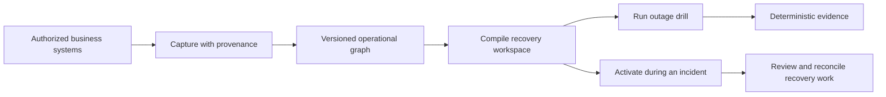

# ARK

ARK keeps a company operational when the software it depends on stops working.

Most companies run critical workflows across several SaaS products. Customer
records live in a CRM, contracts live in a document system, delivery problems
live in an issue tracker, and the people responsible for the work are defined
somewhere else. If one account is suspended, an identity provider fails, or a
vendor has a long outage, having a database export does not tell the team how to
keep working.

ARK is building a tested recovery environment for those moments.

## The problem in human terms

Imagine an important customer renewal is due today. The account owner needs the
customer record, renewal deal, signed contract, and unresolved delivery issues
before creating the renewal task.

Now imagine the CRM and document system are both unavailable.

A conventional backup may contain some of the data, but it still leaves hard
questions:

- Which export is current?
- How do records from different systems relate to each other?
- Are the contract attachments complete and unmodified?
- Which information was missing from the official export?
- Can employees actually complete the workflow without the original vendors?
- How do we prove the recovery path worked before a real emergency?
- What happens to work created while the source systems are offline?

ARK turns those questions into something executable and testable.

## What we are building

ARK captures authorized operational state from the systems a company depends
on, preserves where every important value came from, and compiles only the data
and actions required for a critical workflow into an independent recovery
workspace.

It then repeatedly disables the assumed source systems and attempts the real
workflow against that workspace. Deterministic checks decide whether the result
is correct. A successful drill produces evidence showing exactly what was
available, how fresh it was, what passed, what failed, and which external
dependencies still remained.

During a real incident, an authorized operator can activate the latest verified
build, let the team continue limited operations, record everything created in
recovery mode, and later reconcile those changes when the original system or a
replacement becomes available.



## The flagship proof

The first complete demonstration protects one workflow: preparing a customer
renewal.

Two independent source applications will hold the CRM and operational records.
ARK will capture the customer, deal, owner, contract, attachments, and open
issues through authorized boundaries. Both source applications will then be
forced offline.

With those systems unavailable, ARK must launch a clean recovery workspace and:

1. find the correct customer and renewal deal;
2. retrieve the governing contract and verify its checksum;
3. show the unresolved high-severity delivery issues;
4. create exactly one renewal task for the correct account owner; and
5. produce evidence proving the workflow succeeded without either source.

The goal is not a polished page that says “backup complete.” The goal is a
repeatable demonstration that useful work can continue during an actual
dependency failure.

## Why Solari matters

ARK uses isolated remote computers for the parts of recovery that cannot be
proven with a database dump alone:

- Solari browsers can access authorized web applications, exercise their real
  interfaces, capture missing boundaries, and replay test workflows.
- Solari sandboxes can process untrusted exports, build recovery applications,
  run deterministic verifiers, and host isolated emergency workspaces.
- Solari desktops will extend the same model to GUI-only and legacy software
  that cannot be recovered through an API or browser.

The Solari API key stays on backend workers. It is never exposed to the web
application, recovery data, evidence, or recordings.

## Run ARK locally

### Requirements

- Node.js 24 or newer
- Corepack with pnpm 11
- Docker with Docker Compose
- A Solari API key only for the opt-in live test

Install the workspace:

```bash
corepack enable
pnpm install
```

Create the ignored local environment files:

```bash
cp .env.example .env
cp infra/compose/.env.example infra/compose/.env
```

Then set your Solari key in the root `.env`:

```dotenv
SOLARI_API_KEY=<your-solari-api-key>
```

The remaining development services use the local credentials in
`infra/compose/.env`; they do not require external accounts or keys.

Start PostgreSQL, Redis, and MinIO:

```bash
docker compose \
  --env-file infra/compose/.env \
  -f infra/compose/docker-compose.yml \
  up -d --wait
```

Apply local database migrations:

```bash
pnpm db:migrate:local
```

Run the standard quality suite:

```bash
pnpm check
pnpm test:e2e
```

Run PostgreSQL integration tests:

```bash
set -a
source infra/compose/.env
set +a
pnpm test:integration
```

Run the opt-in live Solari test:

```bash
pnpm test:live-solari
```

The live test creates one budget-bounded sandbox, executes a deterministic
command, and destroys the sandbox in a `finally` path.

Stop local infrastructure when finished:

```bash
docker compose \
  --env-file infra/compose/.env \
  -f infra/compose/docker-compose.yml \
  down --volumes
```

## Repository structure

```text
apps/
  api/       Control-plane API
  cli/       Operator commands
  web/       Control-plane web application
  worker/    Capture, build, and drill workers

packages/
  config/    Validated server configuration
  db/        Drizzle schema, migrations, and tenant repositories
  domain/    Identifiers, state machines, provenance, events, and policy
  testkit/   Shared fixtures and live Solari checks

infra/
  compose/   Local PostgreSQL, Redis, and MinIO
  migrations/ PostgreSQL migrations and Drizzle metadata

examples/    Original focused Solari cookbook examples
```

## Solari cookbook examples

The original small browser, sandbox, and desktop examples remain available in
[examples](examples/). They are useful when working on ARK's Solari execution
layer or learning one SDK surface in isolation.

Useful links:

- [Solari documentation](https://docs.getsolari.com)
- [Solari console](https://console.getsolari.com)
- [Solari changelog](https://changelog.getsolari.com)

## License

MIT
